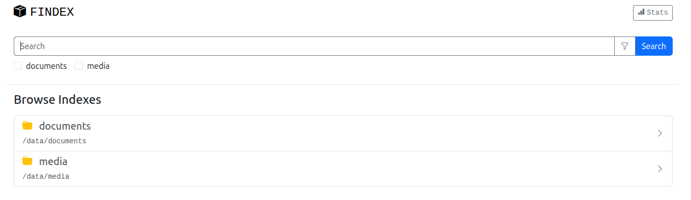
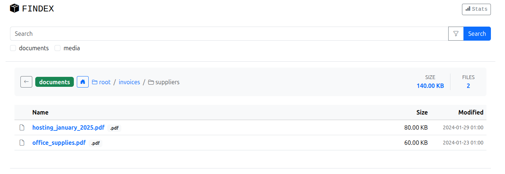
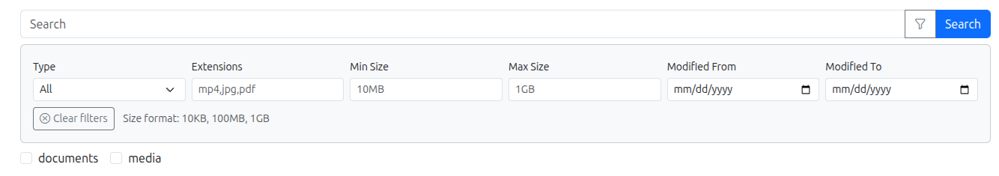
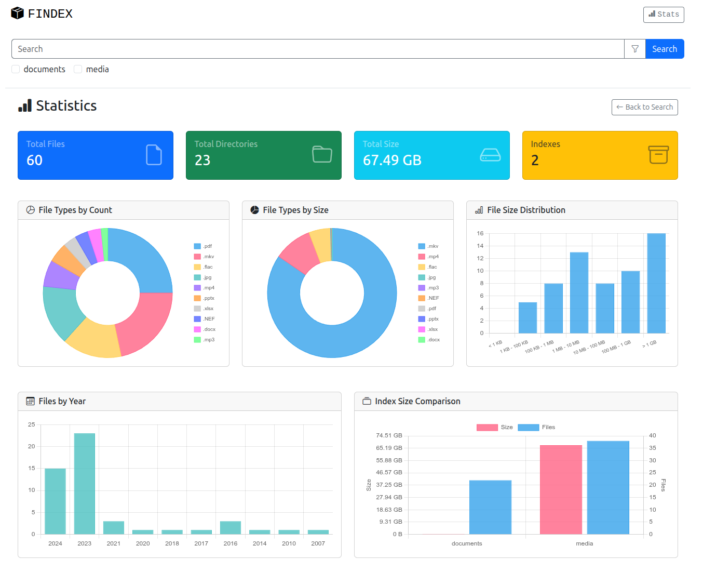

# FIndex

**FIndex** is a fast, privacy-focused file indexing and search tool. It indexes your files into a local SQLite database with full-text search (FTS5), allowing you to quickly find files across multiple directories from a clean web interface.

## Use Cases

- **Media library management** - Index your movies, music, and photos across multiple drives
- **Document search** - Quickly find documents in large archives
- **NAS file discovery** - Browse and search files on network storage
- **Personal file organization** - Keep track of files scattered across different locations
- **Offline file catalog** - Index files that aren't always accessible (external drives, remote servers)

## Key Features

- **Privacy-first** - Everything runs locally, no external connections, no telemetry
- **Fast full-text search** - SQLite FTS5 provides instant search results
- **Multiple indexes** - Organize files into separate searchable collections
- **Advanced filtering** - Filter by size, extension, date, file type
- **Directory browsing** - Navigate through indexed directory structures
- **Statistics & insights** - View storage usage, file type distribution, largest files
- **Responsive design** - Works on desktop and mobile devices
- **Docker support** - Easy deployment with persistent data
- **Lightweight** - Single binary, minimal resource usage

## Screenshots

### Start Page


### File Browser


### Advanced Filtering


### Statistics


## Quick Start

### Try the Demo

The easiest way to explore FIndex is to run the included demo with pre-populated sample data:

```bash
# Clone the repository
git clone https://github.com/ogefest/findex.git
cd findex

# Build the application
make build

# Run with demo configuration
./bin/webserver -config demo/config.yaml
```

Open http://localhost:8080 in your browser to explore the demo.

### Installation

#### Option 1: Build from Source

Requirements: Go 1.23+, Make

```bash
# Clone and build
git clone https://github.com/ogefest/findex.git
cd findex
make build

# Binaries will be in ./bin/
# - findex     : Indexer (scans files and builds the database)
# - webserver  : Web UI for searching and browsing
```

#### Option 2: Docker

```bash
# Clone the repository
git clone https://github.com/ogefest/findex.git
cd findex

# Create your configuration
cp config.example.yaml config.yaml
# Edit config.yaml to add your directories

# Build and run
docker compose up -d

# Access at http://localhost:8080
```

## Configuration

Create a `config.yaml` file based on `config.example.yaml`:

```yaml
server:
  port: 8080

indexes:
  - name: "documents"
    db_path: "./data/documents.db"
    source_engine: "local"
    refresh_interval: 86400  # 24 hours in seconds
    root_paths:
      - "/path/to/your/documents"
    exclude_paths:
      - "/path/to/your/documents/private"

  - name: "media"
    db_path: "./data/media.db"
    source_engine: "local"
    refresh_interval: 604800  # 7 days
    root_paths:
      - "/path/to/movies"
      - "/path/to/music"
```

### Configuration Options

| Field | Description |
|-------|-------------|
| `name` | Unique identifier for the index (displayed in UI) |
| `db_path` | Path to SQLite database file |
| `source_engine` | Storage backend (`local` for filesystem) |
| `root_paths` | List of directories to index |
| `exclude_paths` | Directories to skip during indexing |
| `refresh_interval` | Minimum seconds between re-indexing (0 = always re-index) |

## How It Works

FIndex operates in two stages:

### 1. Indexing (Building the Database)

The indexer scans your configured directories and stores file metadata (name, path, size, modification time) in a SQLite database. **Files must be indexed before they can be searched.**

```bash
# Run the indexer
./bin/findex -config config.yaml
```

The indexer:
- Walks through all files in configured `root_paths`
- Skips directories in `exclude_paths`
- Stores metadata in SQLite with FTS5 full-text index
- Respects `refresh_interval` to avoid unnecessary re-scans

**Important:** Run the indexer regularly to keep your search index up to date. You can:
- Run it manually when needed
- Set up a cron job for scheduled updates
- Use the Docker indexer service

#### Scheduled Indexing with Cron

```bash
# Example: Re-index every day at 3 AM
0 3 * * * /path/to/findex -config /path/to/config.yaml
```

#### Scheduled Indexing with Docker

```bash
# Manual run
docker compose --profile indexer run --rm findex-indexer

# Or set up a cron job on the host
0 3 * * * docker compose --profile indexer run --rm findex-indexer
```

### 2. Searching (Web Interface)

The web server provides a UI to search and browse your indexed files:

```bash
# Start the web server
./bin/webserver -config config.yaml
```

Then open http://localhost:8080 in your browser.

## Search Features

### Basic Search
Type any keywords to search across file names and paths:
- `report` - finds files containing "report"
- `vacation photos` - finds files containing both words

### Exclusion
Prefix a term with `-` to exclude it:
- `report -draft` - finds "report" but not "draft"

### Filtering
Click the filter icon to refine results:
- **Extension** - e.g., `pdf`, `mkv,mp4`, `jpg,png,gif`
- **Size** - e.g., min `100MB`, max `4GB`
- **Date** - modification date range
- **Type** - files only or directories only

## Docker Deployment

### docker-compose.yaml

```yaml
services:
  findex:
    build: .
    ports:
      - "8080:8080"
    volumes:
      - findex_data:/app/data
      - ./config.yaml:/app/config.yaml:ro
      # Mount directories to index (read-only)
      - /path/to/your/files:/data/files:ro

volumes:
  findex_data:
```

### Persistent Data

The `findex_data` volume stores SQLite databases. This ensures:
- Data survives container restarts
- You can update the application without losing indexes
- Databases are isolated from the application

### Updating

```bash
# Pull latest changes and rebuild
git pull
docker compose build --no-cache
docker compose up -d
```

## Project Structure

```
findex/
├── cmd/
│   ├── findex/      # Indexer CLI
│   └── webserver/   # Web server
├── app/             # Core business logic
├── models/          # Data structures
├── web/
│   ├── run/         # HTTP handlers
│   ├── templates/   # HTML templates
│   └── assets/      # CSS, JS, icons
├── demo/            # Demo configuration and data
├── config.example.yaml
├── Dockerfile
└── docker-compose.yml
```

## License

MIT License
